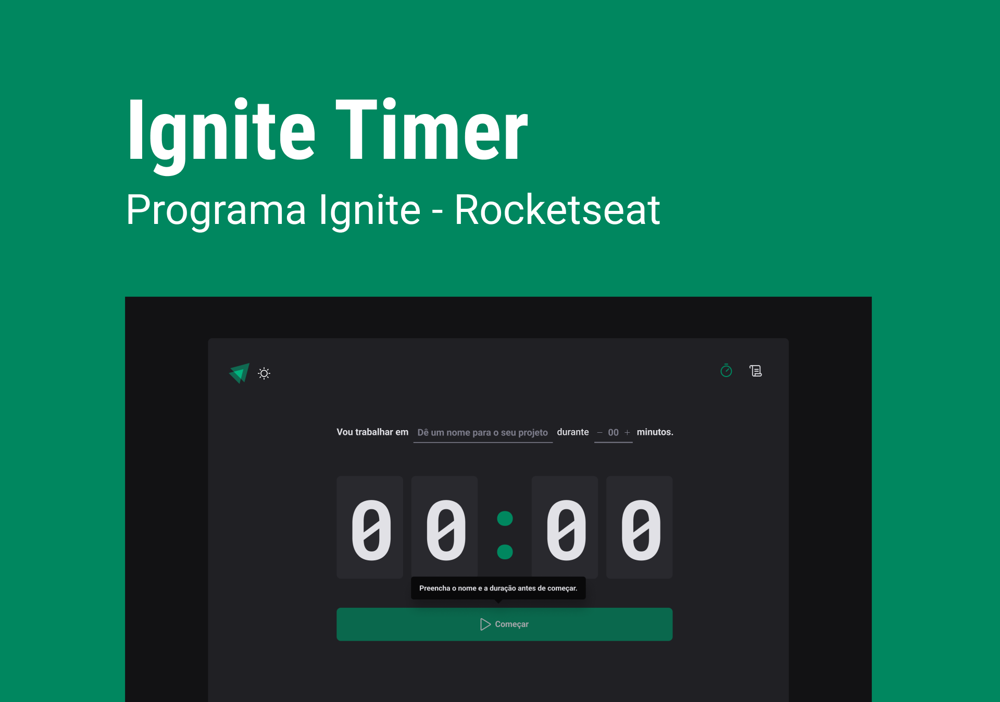

<h1 align="center"> Ignite Timer </h1>

  <a href="#-tecnologias">Tecnologias</a>&nbsp;&nbsp;&nbsp;|&nbsp;&nbsp;&nbsp;
  <a href="#-projeto">Projeto</a>&nbsp;&nbsp;&nbsp;|&nbsp;&nbsp;&nbsp;
  <a href="#-layout">Layout</a>&nbsp;&nbsp;&nbsp;

 

  

## 🚀 Tecnologias e Bibliotecas

Esse projeto foi desenvolvido com as seguintes tecnologias e bibliotecas:

- React
- Vite
- TypeScript
- Styled Components
- React Router Dom
- React Hook Form
- Context API
- Reducers
- Immer
- Zod
- Date-fns

## 💻 Sobre o Projeto

Ignite Timer é um o projeto que consiste em um CountDown para estudos ( pode se dizer também que é método de Pomodoro) , nele pode-se criar ciclos, dar-lhe o nome, o tempo e podendo iniciar ou interromper o ciclo. E assim terá outra página de históricos que vai conter suas tarefas finalizadas, em andamento ou interrompidas.

## 📚 Mais informações

- Número de páginas: 2

- Responsivo: ❌

- Hospedado: ✅

## 🔖 Layout

Você pode visualizar o layout do projeto através [DESSE LINK](https://www.figma.com/file/zR6cr7t9GPVtxyhXUYWVEB/Ignite-Timer?type=design&node-id=2-12&mode=design&t=SiJCmIsCyrgVPhqB-0). É necessário ter conta no [Figma](https://figma.com) para acessá-lo.

## 🙋‍♀️ Autora

 

<a href="https://www.linkedin.com/in/ellen-bessa-081773253/">
 
  
 <h2><b>Ellen Bessa</b></h2>
</a>
